# 🛍️ Enhanced Shopping Mall SJ

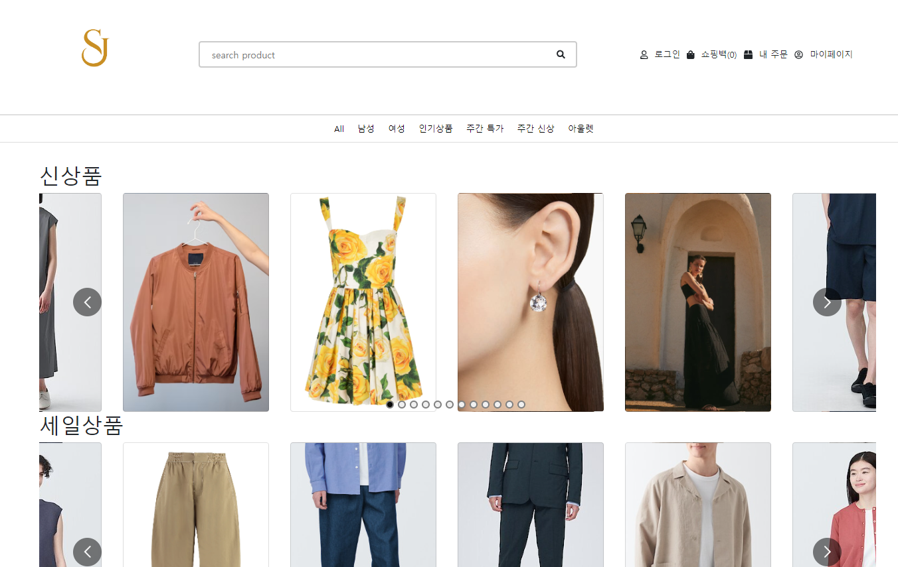
SJ is a website where users can conveniently purchase a variety of clothes.

### Development Period

- Total Development Period: 2024-05-15 to 2024-06-16
- Backend Implementation: 2024-06-03 to 2024-06-08
- Frontend and Feature Implementation: 2024-06-06 to 2024-06-16

### Deployment Links

Frontend Server: <a href="https://sj-shopping-mall.netlify.app/account/profile">https://sj-shopping-mall.netlify.app/account/profile</a>

Backend Server: <a href="http://sj-shopping-mall.ap-southeast-2.elasticbeanstalk.com/">http://sj-shopping-mall.ap-southeast-2.elasticbeanstalk.com/</a>

 

### Test Account

- <b>Test ID</b>: admin@gmail.com
- <b>Test PW</b>: 123

## Project Introduction

<b>SJ</b> is a project where we implemented a shopping mall through clone coding.

- We have designed the main page to allow users to choose their desired products.
- The admin page allows the registration, modification, and deletion of products, orders, and user information.
- Users can select the size of their desired product and proceed to checkout.
   

## Developer

<table>
  <tr>
    <td></td>
  </tr>
  <tr>
    <td style="text-align: center;">Sung U Jung <a href="https://github.com/SungJung0616">@SungJung0616</a></td>
  </tr>
</table>

 

# Project Overview

## User Features

1. **Sign Up**
   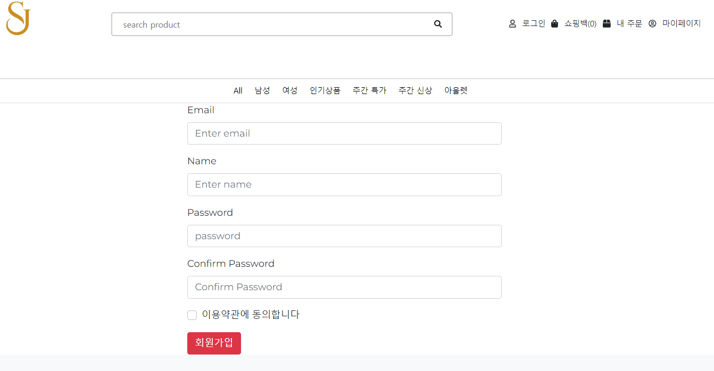

2. **Login**

   - Email login
   - External account login
     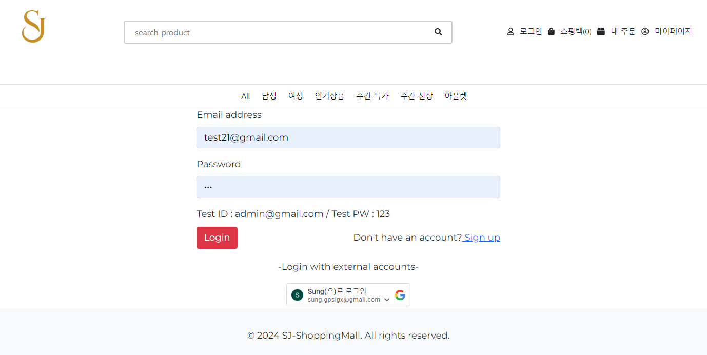

3. **Shopping Mall Landing Page**

   - Search functionality
   - Logout button
   - Shopping bag button
   - My orders button
     

4. **Product Detail Page**

   - Add product to cart
   - Select product size
     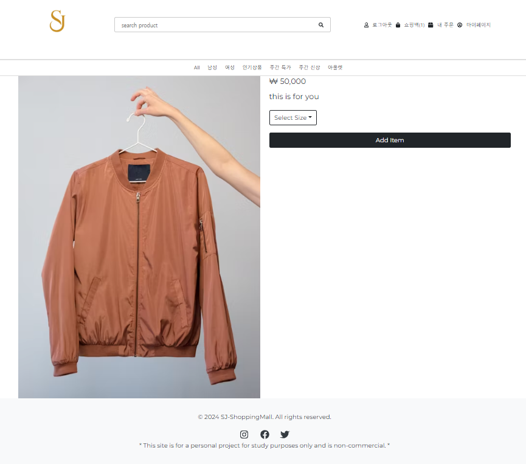

5. **Cart Page**

   - Display selected items
   - Modify item quantity
   - Delete items
   - Proceed to checkout
     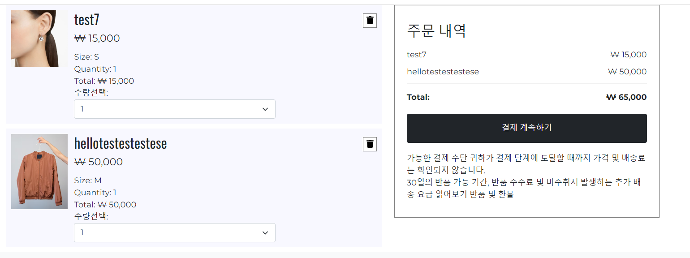

6. **Checkout Page**

   - Prevent checkout if stock is insufficient
     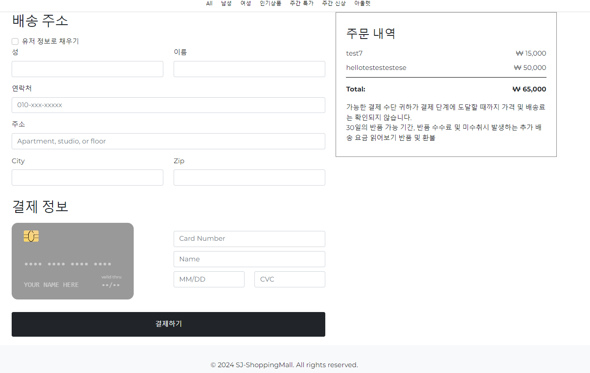

7. **Order Completion Page**

   - Display order number
   - View order details and status
     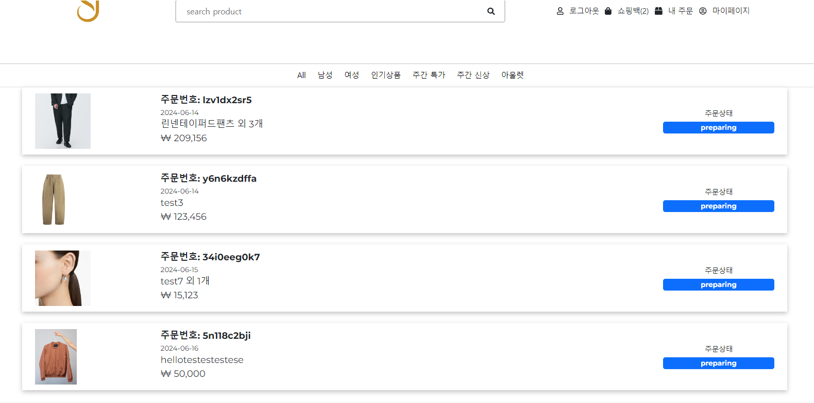

## Admin Page

1. **Product List Page**

   - Add new products
   - Search products
   - Edit and delete product information
   - Pagination
     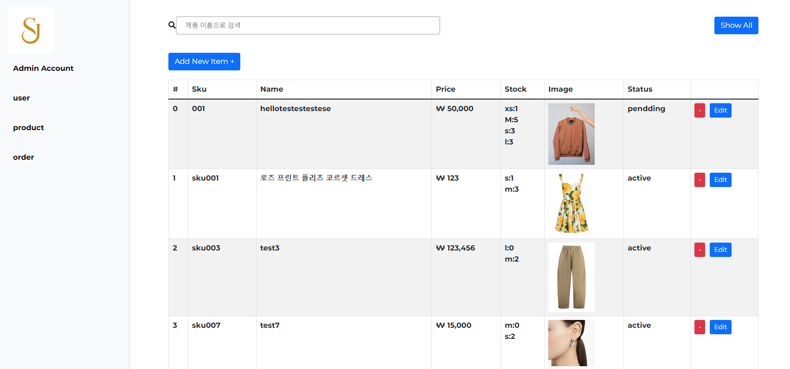

2. **Order Page**

   - View order details
   - Update order status
   - Search by order number
     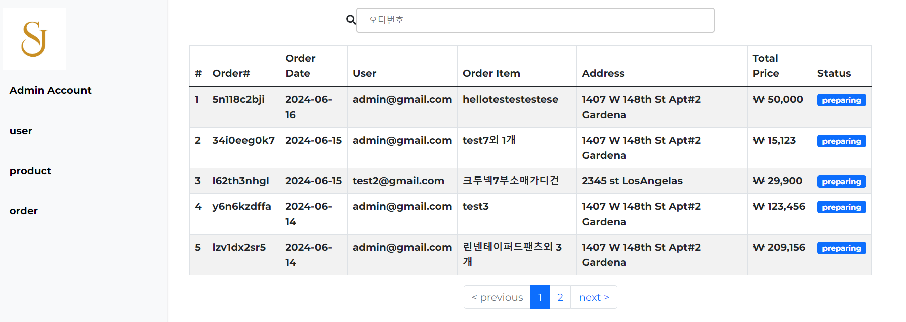

3. **User Page**

   - View user details
   - Update user level
     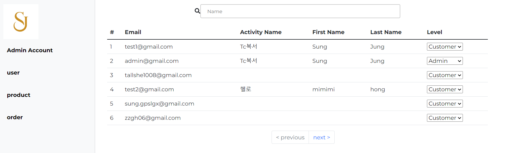

## ERD

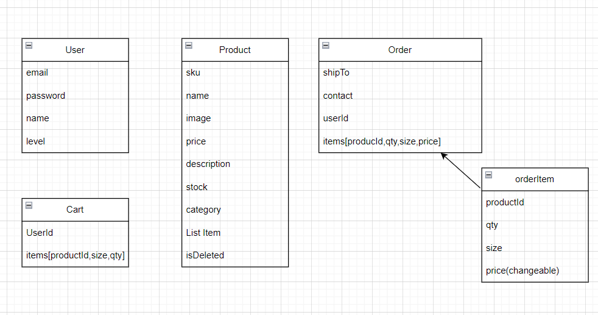

 

## Implementation Plan

## 📚 STACKS

### Environment

 

### Config

### Development

     

### deployment

 

 

### Build the User Interface

- Create the landing page with search, login, and navigation functionalities.
- Implement the product detail page with size selection and add-to-cart functionality.
- Develop the cart page to display, modify, and delete items.
- Create the checkout process with stock verification.
- Design the order completion page with order details and status tracking.

### Admin Interface

- Build the product list page with add, search, edit, delete functionalities, and pagination.
- Create the order page for viewing and updating order details.

### Integration and Testing

- Integrate frontend and backend.
- Implement unit and integration tests to ensure all functionalities work as expected.

### Deployment

- Deploy the application to a hosting service (MongoDB Atlas, backend on AWS, frontend on Netlify).
